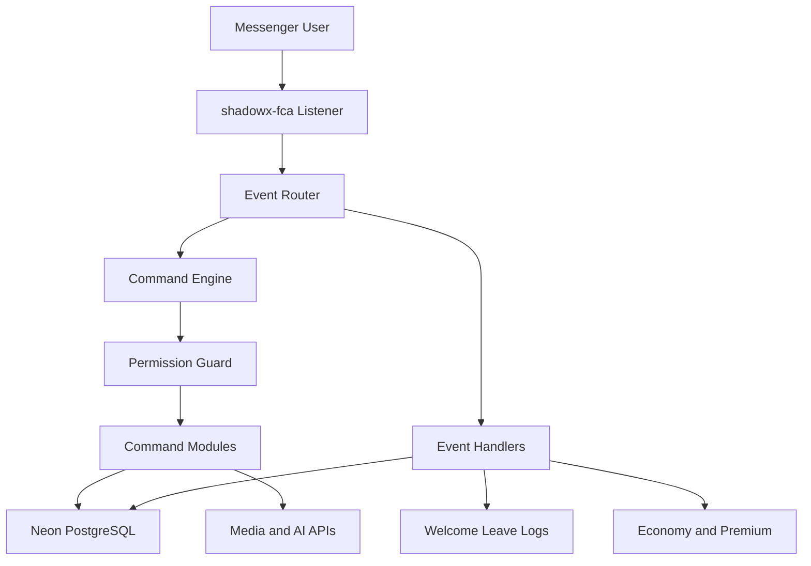

<div align="center">


```console
SHADOWX-BOT v2.0 ── Facebook Messenger Automation Engine
🛠️  Modified by MUEID MURSALIN RIFAT
🟢  status: online   ⚡ engine: shadowx-fca   🐘 database: Neon
```

**A full-stack, event-driven Messenger engine built for scale, speed, and control.**

> *"Not coded to impress, coded to express."*

<br>

<a href="https://github.com/mueidmursalinrifat/shadowx-bot"></a>
<a href="https://github.com/mueidmursalinrifat/shadowx-bot"></a>
<a href="https://github.com/mueidmursalinrifat/shadowx-bot/blob/main/LICENSE"></a>


🌐 [Portfolio](https://mueidmursalinrifat.onrender.com) • 📘 [Facebook](https://www.facebook.com/mueid.mursalin.rifat1) • 📦 [Repository](https://github.com/mueidmursalinrifat/shadowx-bot)

</div>

---

## 📑 Contents

```console
root@shadowx:~$ ./shadowx-bot --help
[ OK ] loading table of contents...
```

- 🧭 [About](#-about)
- ⭐ [Highlights](#-highlights)
- 🚀 [Features](#-features)
- 🏗️ [Architecture](#-architecture)
- 🔐 [Roles](#-roles)
- ⚙️ [Configuration](#-configuration)
- 📥 [Install](#-install)
- ▶️ [Run](#-run)
- 🔧 [Native fix](#-native-fix)
- 📋 [Requirements](#-requirements)
- 🤖 [Auto systems](#-auto-systems)
- 🛠️ [Troubleshooting](#-troubleshooting)
- 🤝 [Contributing](#-contributing)
- 🌟 [Connect](#-connect)
- 🎨 [Identity](#-identity)

---

## 🧭 About

```console
root@shadowx:~$ ./shadowx-bot --describe
[ OK ] account link   : personal facebook
[ OK ] listener       : shadowx-fca realtime events
[ OK ] pipeline       : command + event router
[ OK ] boot complete  : ready to serve
```

SHADOWX-BOT links a personal Facebook account through `shadowx-fca`, listens to real-time events, and pushes every message through a fast command and event pipeline.

Three ideas guide the build.

| Goal | Meaning |
|---|---|
| 🛡️ Reliability | Auto reconnect, MQTT supervision, session backup, and optional uptime pings keep the process alive. |
| 🎛️ Control | Five permission tiers, whitelist mode, admin-only mode, per-thread settings, and a web dashboard. |
| 🧩 Extensibility | Modular commands and events, live script loading, and a clean data layer. |

The result is a large command library with economy, social, gaming, media, AI, group management, and premium features.

---

## ⭐ Highlights

```console
root@shadowx:~$ ./shadowx-bot --highlights
[1/8] 🎨 identity and banner rebuilt
[2/8] 🐘 neon postgres attached
[3/8] ⚡ shadowx-fca session online
[4/8] 🚀 command library verified
[5/8] 💎 premium gate armed
[6/8] 🖥️ dashboard reachable
[7/8] 🔧 native modules healthy
[8/8] 🟢 node 22 runtime locked
[ OK ] all systems nominal
```

- 🎨 Rebuilt identity, banner, and documentation
- 🐘 Neon PostgreSQL by default, with SQLite, JSON, and MongoDB available
- ⚡ `shadowx-fca` login with E2EE bootstrap and appstate backup
- 🚀 **226 commands** across nine categories — explore them all with `.help` in chat 💬
- 💎 Premium membership with expiry tracking
- 🖥️ Dashboard with verification codes and account controls
- 🔧 Self-healing native modules for `canvas`, `sqlite3`, and `bcrypt`
- 🟢 Node 22 runtime with a repeatable build flow

---

## 🚀 Features

```console
root@shadowx:~$ ./shadowx-bot --commands
[ OK ] scanning command registry...
[ OK ] 9 categories loaded
[ OK ] 226 commands mounted
[ OK ] permissions attached
[ READY ] use .help in chat to explore
```

The command library spans AI and image generation, anime and media, economy, games, fun and social, group administration, owner and system tools, utilities, and Islamic features — all gated by the permission tiers below. Explore them in chat with `.help`.

### 🧠 Other systems

Premium gating, whitelist mode, admin-only mode, typing indicator, reaction mirror, event logging, and failure alerts through Gmail, Telegram, or Discord.

```console
root@shadowx:~$ ./shadowx-bot --systems-list
[ OK ] loading system features...
[ OK ] premium, whitelist, admin-only, typing, reaction ready
```

---

## 🏗️ Architecture

```console
root@shadowx:~$ ./shadowx-bot --topology
```



```console
root@shadowx:~$ ./shadowx-bot --describe-arch
[ OK ] component   : Messenger User
[ OK ] component   : shadowx-fca Listener
[ OK ] component   : Event Router
[ OK ] component   : Command Engine
[ OK ] component   : Event Handlers
[ OK ] component   : Permission Guard
[ OK ] component   : Command Modules
[ OK ] component   : Neon PostgreSQL
[ OK ] component   : Media and AI APIs
[ OK ] component   : Welcome Leave Logs
[ OK ] component   : Economy and Premium
[ OK ] architecture built
```

A message arrives through the MQTT listener. The router resolves the prefix, thread settings, and sender role. Commands pass cooldown and permission checks. Data is read or written. Media commands call external APIs. Greeting, warning, and expiry events run in parallel.

```console
root@shadowx:~$ ./shadowx-bot --trace
[1/6] 📡 event received from mqtt listener
[2/6] 🧭 prefix, thread, and role resolved
[3/6] 🔐 cooldown and permission checks passed
[4/6] 🗄️ database read and write
[5/6] 🎨 external api call and attachment
[6/6] ⚙️ parallel event handlers fired
[ OK ] pipeline complete
```

---

## 🔐 Roles

```console
root@shadowx:~$ ./shadowx-bot --roles
[ 4 ] 👑 developer    <- devUsers
[ 3 ] 💎 premium      <- premiumUsers
[ 2 ] 🛡️ bot admin    <- adminBot
[ 1 ] 🧑‍💼 group admin  <- thread admin list
[ 0 ] 👤 member       <- default
```

Tiers are checked in strict priority order.

| Tier | Level | Source |
|---|:---:|---|
| 👑 Developer | **4** | `devUsers` |
| 💎 Premium | **3** | `premiumUsers` |
| 🛡️ Bot Admin | **2** | `adminBot` |
| 🧑‍💼 Group Admin | **1** | Thread admin list |
| 👤 Member | **0** | Default |

Each command declares the minimum tier it needs. Premium and developer checks finish before group and member checks.

---

## ⚙️ Configuration

```console
root@shadowx:~$ cat config.json | ./shadowx-bot --keys
[ OK ] prefix, usePrefix
[ OK ] adminBot, devUsers, premiumUsers
[ OK ] database.type, database.uriNeon
[ OK ] dashBoard, serverUptime
[ OK ] autoRestart, autoUptime, autoLoadScripts
[ OK ] whiteListMode, logEvents, optionsFca
```

Everything lives in `config.json`. These keys matter most.

| Key | Purpose |
|---|---|
| `prefix` | Default command prefix, `.` |
| `usePrefix` | No-prefix mode, global or admin-only |
| `adminBot`, `devUsers`, `premiumUsers` | Account IDs per tier |
| `database.type` | `neon`, `sqlite`, `json`, or `mongodb` |
| `database.uriNeon` | Neon connection string |
| `dashBoard` | Port, admin key, code expiry |
| `serverUptime` | External uptime reporting |
| `autoRestart` | Interval or cron expression |
| `autoUptime` | Self-ping to stay awake |
| `autoLoadScripts` | Reload changed files |
| `autoRefreshFbstate` | Refresh the session |
| `autoReloginWhenChangeAccount` | Re-login on account switch |
| `restartListenMqtt` | Listener restart interval |
| `notiWhenListenMqttError` | Failure alert channels |
| `whiteListMode` | Limit usage to approved IDs |
| `hideNotiMessage` | Silence chosen warnings |
| `logEvents` | Per-type event logging |
| `optionsFca` | Engine flags such as force login and presence |

Credentials load from `account.txt`, `account2.txt`, and `account3.txt`. The bot tries each until one succeeds.

---

## 📥 Install

```console
git clone https://github.com/mueidmursalinrifat/shadowx-bot.git
cd shadowx-bot
npm install
```

The install step checks `canvas`, `sqlite3`, and `bcrypt` against the current Node build and rebuilds anything that fails.

---

## ▶️ Run

```console
node index.js
# or
npm start
```

The web service listens on `process.env.PORT` or port `3000`.

---

## 🔧 Native fix

Automatic on every install. Manual when needed:

```console
npm run fix:canvas
```

It loads each native module, rebuilds failures with `npm rebuild <module> --foreground-scripts`, then loads them again to confirm. This clears the classic mismatch:

```console
Error: The module '.../canvas/build/Release/canvas.node'
was compiled against a different Node.js version using
NODE_MODULE_VERSION 127. This version of Node.js requires
NODE_MODULE_VERSION 137.
```

---

## 📋 Requirements

| Item | Version |
|---|---|
| Node.js | 22.x |
| npm | 9+ |
| Git | Latest |
| Build tools | `python3`, `make`, `g++` |
| Messenger account | Required |

```console
apt-get update
apt-get install -y python3 make g++
```

---

## 🤖 Auto systems

```console
root@shadowx:~$ ./shadowx-bot --auto
[ armed ] 🔌 auto reconnect
[ armed ] 📡 mqtt supervision
[ armed ] 💾 session backup
[ armed ] 🔄 scheduled restart
[ armed ] 🧩 script reload
[ armed ] ⏳ premium expiry
[ armed ] 👋 welcome + leave
[ armed ] ⚠️ warning system
```

Reconnect handles network drops. MQTT supervision restarts the listener on a timer. Session backup saves appstate and cookies. Scheduled restart follows a cron or interval. Script loading reloads changed files. Expiry checks clear lapsed premium. Greeting events fire on join and leave. The warning system tracks and acts.

---

## 🛠️ Troubleshooting

| Symptom | Fix |
|---|---|
| Canvas version mismatch | `npm run fix:canvas` |
| Bot exits at once | Check console output and validate `config.json` |
| Login loop | Refresh the session, confirm the account is not blocked |
| Database offline | Check `database.type` and `database.uriNeon` |
| Command missing | Confirm the file loaded and the prefix matches |
| Native build fails | Install build tools, then rebuild |
| Port in use | Change `PORT` or the dashboard port |

```console
tail -n 100 logs/bot.log
```

---

## 🌟 Connect

```console
root@shadowx:~$ ./shadowx-bot --connect
[ OK ] connecting to portfolio...
[ OK ] connecting to facebook...
[ OK ] connecting to repository...
[ OK ] all connections established
```

```
🌐 Portfolio: https://mueidmursalinrifat.onrender.com
📘 Facebook: https://www.facebook.com/mueid.mursalin.rifat1
📦 GitHub: https://github.com/mueidmursalinrifat/shadowx-bot
```

Star, fork, report bugs, suggest features, or send improvements.

---

## 🎨 Identity

```console
root@shadowx:~$ ./shadowx-bot --version

  ⚡ SHADOWX-BOT
  🛠️ modified by MUEID MURSALIN RIFAT
  🟢 runtime  Node.js 22.x
  🐘 database Neon PostgreSQL
  ⚡ engine   shadowx-fca
  📜 license  MIT
```

| Field | Value |
|----|:---:|---|
| 🌐 Web portfolio | [mueidmursalinrifat.onrender.com](https://mueidmursalinrifat.onrender.com) |
| 📘 Facebook | [mueid.mursalin.rifat1](https://www.facebook.com/mueid.mursalin.rifat1) |
| 📦 GitHub | [shadowx-bot](https://github.com/mueidmursalinrifat/shadowx-bot) |

<div align="center">

**Not coded to impress, coded to express.**

*Mueid Mursalin Rifat*

<a href="https://mueidmursalinrifat.onrender.com"></a>
<a href="https://www.facebook.com/mueid.mursalin.rifat1"></a>
<a href="https://github.com/mueidmursalinrifat/shadowx-bot"></a>


</div>
